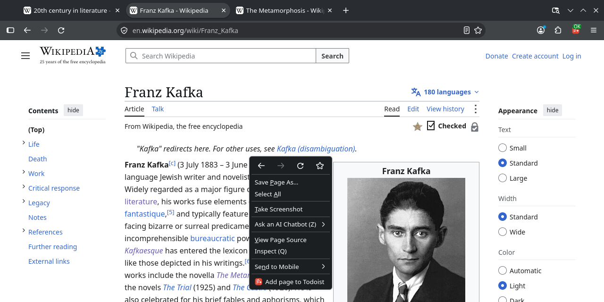
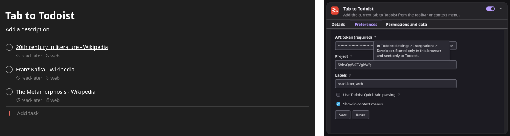

# Tab to Todoist

A Firefox add-on that adds the current tab to Todoist as a link task.

See [Releases](https://github.com/probecat/tab-to-todoist/releases) for additional signed builds.

## Screenshots

---

This add-on is feature complete. Bug reports and fixes are welcome; a Chromium port may be considered on request. [MIT](LICENSE) licensed. Not created by, affiliated with, or supported by Doist.
